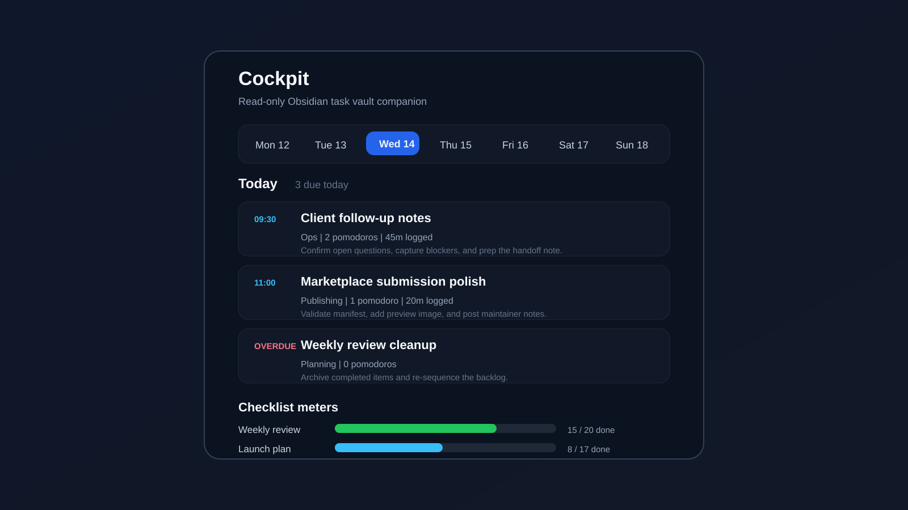

# Cockpit Companion

Read-only Omarchy bar widget for an Obsidian task vault.



## What it does

- Shows a compact week view that can expand to a month grid
- Lists the selected day's tasks in board order
- Highlights overdue tasks
- Shows optional checklist progress meters for selected files
- Runs a task-attached pomodoro timer without writing back to the vault

## Requirements

- Omarchy / Quickshell plugin support
- Obsidian installed locally
- An Obsidian vault with tasks stored in `Tasks/Active/*.md`
- The Obsidian `cockpit-board` plugin if you want shared pomodoro settings and board ordering

## Configuration

The main setting is `vaultDir`, which should point at the root of your Obsidian vault.

Default settings:

```json
{
  "vaultDir": "~/Obsidian",
  "refreshIntervalSec": 60,
  "workMinutes": 25,
  "breakMinutes": 5,
  "checklistPatterns": ""
}
```

`checklistPatterns` accepts comma-separated filename globs relative to `Tasks/Active`, for example `weekly-review*,launch-plan`.

## Privacy

This plugin is read-only. It scans vault files and keeps temporary pomodoro state in `XDG_RUNTIME_DIR`. It never writes to the Obsidian vault.

## Install

```bash
omarchy plugin add <repo-url> --enable --yes
```

Or copy the directory into `~/.config/omarchy/plugins/andreconde.cockpit/` and run:

```bash
omarchy-shell shell rescanPlugins
omarchy plugin enable andreconde.cockpit
```

## Remove

```bash
omarchy plugin remove andreconde.cockpit
```

If you installed it by copying the directory manually, delete `~/.config/omarchy/plugins/andreconde.cockpit/`, then run:

```bash
omarchy-shell shell rescanPlugins
```
